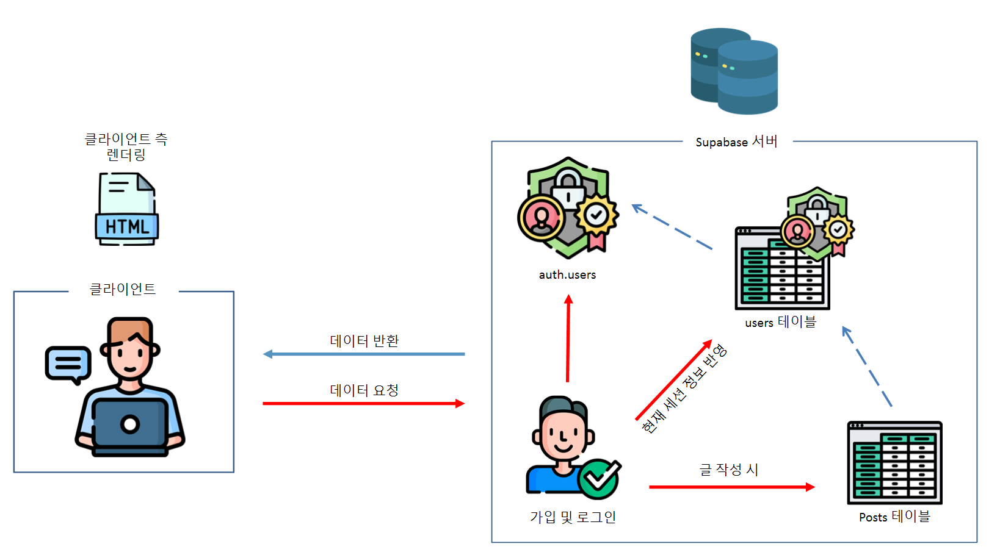
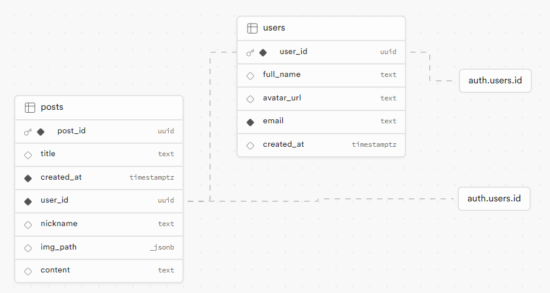

# 롤무위키

## B-10조 (게임알려조)

1주차

### 강희진, 김영범, 석재영, 안시승

`튜터 유진영`

오른쪽에 사진 넣으면 됨

---

## 목차

1. 프로젝트 개요

2. 프로젝트 팀 구성 및 역할

3. 프로젝트 수행 절차 및 방법

4. 프로젝트 수행 경과

5. 자체 평가 의견

---

1. 프로젝트 개요

---

2. 프로젝트 팀 구성 및 역할

| 이름   | 구분 | 역할                                                            |
| ------ | ---- | --------------------------------------------------------------- |
| 김영범 | 팀장 | 게시글 CRUD (글 작성, 수정, 삭제)                               |
| 강희진 | 팀원 | 소셜 로그인, 이메일 패스워드 기반 로그인&회원가입&패스워드 변경 |
| 석재영 | 팀원 | 마이페이지 구성 (내 게시물 보기 & 프로필 수정)                  |
| 안시승 | 팀원 | 페이지들의 전반적인 구조 & UI 구현                              |
| 유진영 | 튜터 | SA 피드백, 프로젝트 기술 질의 응답                              |

---

3. 프로젝트 수행 절차 및 방법

| 구분          | 일자            | 활동                                                                        | 비고               |
| ------------- | --------------- | --------------------------------------------------------------------------- | ------------------ |
| 사전 기획     | 5/31(금)        | 프로젝트 기획 및 주제선정, 와이어프레임 작성, 컨벤션 설정,팀원 별 파트 선정 | 프로젝트 주제 선정 |
| 데이터 수집   | 6/3(월)         | Supabase 데이터 수집                                                        |                    |
| 프로젝트 구현 | 6/3(월)~6/6(목) | 프로젝트 파트별 구현                                                        | 팀원 별 파트 구현  |
| 사이트 배포   | 6/7(금)         | 파트 최종 취합 및 사이트 배포                                               |                    |

---

## 프로젝트 수행 경과

### (1) 기술적 의사결정

| 요구사항            | 활용한 기술      | 이유                                                                                                                                          |
| ------------------- | ---------------- | --------------------------------------------------------------------------------------------------------------------------------------------- |
| css styling library | style-components | CSS-in-JS 방식으로 간편한 컴포넌트 스타일링이 가능해 선택                                                                                     |
| Javascript Library  | React            | 간결한 구성의 서비스로 SPA 를 선택, 이용자가 작성한 게시물을 계속해서 렌더링 할 필요가 있음. 따라서 필요한 부분만 렌더링을 진행하기 위해 이용 |

---

### (2) 기술적 의사결정

| 요구사항              | 활용한 기술   | 이유                                                                                                                                        |
| --------------------- | ------------- | ------------------------------------------------------------------------------------------------------------------------------------------- |
| 데이터베이스          | Supabase      | 본 서비스는 회원이나 게시글 관리를 위한 특성상 관계형 데이터 베이스가 필요하며 Supabase 가 별도의 백엔드 서버를 구축하는 부담을 덜어줘 선택 |
| 전역 상태관리 Library | Redux Toolkit | 기존 Redux 에 비해 훨씬 간결한 상태 관리 방법을 제공하기에 선택                                                                             |
| 버전 관리             | Git           | 개발 과정에서 효율적인 분업, 파일 관리를 위해 선택                                                                                          |

---

### (3) 프로젝트 주요 기능

회원 가입 이외에도 소셜 로그인 기능

---

### (4) 프로젝트 주요 기능

---

### (5) 흐름도

---

### (6) 데이터 베이스 구조도

---

### (7) 트러블 슈팅 및 고민

---

#### 출처

<!-- _class: tinytext -->

블로거 아이콘 제작자: Freepik - Flaticon (https://www.flaticon.com/kr/free-icons/)
참석하다 아이콘 제작자: Freepik - Flaticon (https://www.flaticon.com/kr/free-icons/)
데이터 베이스 아이콘 제작자: juicy_fish - Flaticon (https://www.flaticon.com/kr/free-icons/)
Html 아이콘 제작자: Freepik - Flaticon (https://www.flaticon.com/kr/free-icons/)
표 아이콘 제작자: Nikita Golubev - Flaticon (https://www.flaticon.com/kr/free-icons/)
아이콘 제작자: Freepik - Flaticon (https://www.flaticon.com/kr/free-icons/)
아이콘 제작자: Eklip Studio - Flaticon (https://www.flaticon.com/kr/free-icons/)
