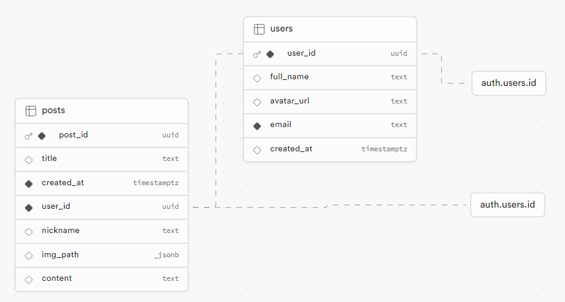

# 롤무위키(LoLmuwiki)

`슬기로운 협곡 생활을 위해`

## 팀원

| 이름   | 구분 | 역할                                                            |
| ------ | ---- | --------------------------------------------------------------- |
| 김영범 | 팀장 | 게시글 CRUD (글 작성, 수정, 삭제)                               |
| 강희진 | 팀원 | 소셜 로그인, 이메일 패스워드 기반 로그인&회원가입&패스워드 변경 |
| 석재영 | 팀원 | 마이페이지 구성 (내 게시물 보기 & 프로필 수정)                  |
| 안시승 | 팀원 | 페이지들의 전반적인 구조 & UI 구현                              |

## 구현한 기능

- 이메일 인증을 통한 회원가입 및 로그인
- 소셜 계정 로그인
- 로그인 토큰 만료 전 자동 갱신
- 로그인 여부에 따라 헤더 UI 변경
- 마이페이지(내 프로필 정보 조회, 작성한 게시글 조회 및 수정, 프로필 정보는 변경 불가)
- 게시글 조회(메인 페이지 내에서는 대표 이미지와 글 내용 일부 미리보기)
- 게시글 목록 클릭 시 전체 내용을 보여주는 모달 구현
- 게시글 작성(이미지 첨부 가능, 한 게시글 당 최대 2개의 이미지)
- 로그인 하지 않을 시 게시글 작성 불가
- 게시글 수정(제목과 내용 수정 가능, 그러나 첨부한 이미지 수정은 불가)

## Code Conventions

### **깃허브 규칙**

- main branch 는 배포를 위한 branch 로, 기능이 문제 없이 동작할 때 merge 를 수행한다.
- dev branch 를 생성해, 개발 시에는 dev 를 기반으로 작업한다.
- 브랜치 이름 : 수정 중인 파일/기능 - 생성한 사람(ex. 마이 페이지 작업 시 mypage-kyb)
- 커밋 시에는 수행한 작업 단위로 나눠서 진행, PR 시에는 공지하기
- PR 은 팀원 2명이상 코드 리뷰 진행 후 merge 진행
- 코드 리뷰를 기다리는 것이 어려운 경우 팀원들에게 통보 후 merge 진행 가능

### 커밋 규칙

| 작업 타입   | 작업내용                       |
| ----------- | ------------------------------ |
| ✨ update   | 해당 파일에 새로운 기능이 생김 |
| 🎉 add      | 없던 파일을 생성함, 초기 세팅  |
| 🐛 bugfix   | 버그 수정                      |
| ♻️ refactor | 코드 리팩토링                  |
| 🩹 fix      | 코드 수정                      |
| 🚚 move     | 파일 옮김/정리                 |
| 🔥 del      | 기능/파일을 삭제               |
| 🍻 test     | 테스트 코드를 작성             |
| 💄 style    | css                            |
| 🙈 gitfix   | gitignore 수정                 |
| 🔨script    | package.json 변경(npm 설치 등) |

### .prettierrc

```json
{
  "printWidth": 80, // 한 줄의 최대 길이를 80자로 제한. 초과시 자동 줄 넘김
  "tabWidth": 2, // 탭나 공백으로 들여쓰기 시 너비를 2칸으로 고정.
  "useTabs": false, // 들여쓰기에 탭 대신 공백을 사용.
  "semi": true, // 명령문 끝에 세미콜론을 추가.
  "singleQuote": true, // 문자열을 표현할 때 작은 따옴표를 사용.
  "quoteProps": "as-needed", // 객체 속성 이름에 따옴표를 필요한 경우에만 추가합니다.
  "jsxSingleQuote": false, // JSX에서 속성 값을 나타낼 때 큰 따옴표를 사용.
  "trailingComma": "all", // 가능한 경우 모든 곳에 후행 쉼표를 추가.
  "bracketSpacing": true, // 객체 리터럴의 중괄호 안에 공백을 추가. ex: {foo: bar} -> { foo: bar }
  "jsxBracketSameLine": false, // JSX에서 마지막 >를 다음 줄로 줄 넘김.
  // ex:
  // <div
  //   foo="bar"
  // />
  "arrowParens": "always", // 화살표 함수의 매개변수에 항상 괄호를 추가. ex: (x) => x
  "proseWrap": "preserve", // 마크다운 텍스트를 원래대로 유지합니다. Prettier가 강제로 줄바꿈이 되는 것을 막음.
  "htmlWhitespaceSensitivity": "css", // HTML 파일에서 공백 처리를 CSS 규칙에 맞춤.
  "endOfLine": "lf" // 줄바꿈 문자를 LF(Line Feed, `\n`)로 설정.
}
```

## 프로젝트 구조 트리

```
LoLmuwiki                                                          //
├─ .gitignore                                                      //
├─ .prettierrc                                                     //
├─ LICENSE                                                         //
├─ README.md                                                       //
├─ Supabase-Schema-Visualizer.png                                  //
├─ index.html                                                      //
├─ package-lock.json                                               //
├─ package.json                                                    //
├─ src                                                             //
│  ├─ App.jsx                                                      //
│  ├─ GlobalStyle.jsx                                              //
│  ├─ assets                                                       //
│  │  ├─ favicon                                                   //
│  │  │  └─ favicon.ico                                            //
│  │  └─ img                                                       //
│  │     ├─ github.png                                             //
│  │     ├─ google.png                                             //
│  │     ├─ kakao.png                                              //
│  │     ├─ logo.png                                               //
│  │     └─ my_profile.png                                         //
│  ├─ components                                                   //
│  │  ├─ AccountInfo.jsx                                           //
│  │  ├─ AccountInfoItem.jsx                                       //
│  │  ├─ FeedList.jsx                                              //
│  │  ├─ ForgotPassword.jsx                                        //
│  │  ├─ Header.jsx                                                //
│  │  ├─ LoginModal.jsx                                            //
│  │  ├─ PostDeleteButton.jsx                                      //
│  │  ├─ PostUpdateButton.jsx                                      //
│  │  ├─ PostViewModal.jsx                                         //
│  │  ├─ ProfilePicture.jsx                                        //
│  │  ├─ ResetPassword.jsx                                         //
│  │  ├─ Sidebar.jsx                                               //
│  │  ├─ SignUpForm.jsx                                            //
│  │  ├─ ToTopBtn.jsx                                              //
│  │  └─ Video.jsx                                                 //
│  ├─ main.jsx                                                     //
│  ├─ pages                                                        //
│  │  ├─ Home.jsx                                                  //
│  │  ├─ Login.jsx                                                 //
│  │  ├─ MyPage.jsx                                                //
│  │  ├─ MyPosts.jsx                                               //
│  │  └─ Post.jsx                                                  //
│  ├─ redux                                                        //
│  │  ├─ config                                                    //
│  │  │  └─ configStore.js                                         //
│  │  └─ slices                                                    //
│  │     └─ authSlice.js                                           //
│  └─ shared                                                       //
│     ├─ AuthCallback.jsx                                          //
│     ├─ Router.jsx                                                //
│     └─ supabaseClient.js                                         //
├─ vercel.json                                                     //
└─ vite.config.js                                                  //
```

## DB 구조도



## Trouble Shooting

1. 게시글을 수정할때에 첫 구현으로 textarea로 구성했지만 그림파일이 textarea로 들어가는 것이 불가능
   div 로 설정해 `contentEditable` 프로퍼티를 추가한 뒤 창에 같이 뜨게 하는것을 구현시켰지만 텍스트와 이미지 모두 수정 실패.
   그 타협점으로 그림파일을 텍스트 인풋창 위로 띄우고 텍스트만 따로 수정할수있게 구현함.

2. 마이페이지 라는 기능으로 사용자가 로그인시 계정 정보와 프로필 정보를 보여주는 페이지를 만들었고, AccountInfo, AccountInfoItem, ProfilePicture, ProfilePicture, Sidebar 각 컴포넌트 마다 사용자의 계정 정보를 표시하거나 프로필 사진을 표시하고 업데이트할 수 있는 기능을 추가하였고 개발중 사용자 정보 업데이트 시 실시간으로 반영되지 않음에 트러블 슈팅이 있었습니다. 추가적으로 프로필 사진을 변경한 상태로 Supabase users테이블 avatar_url이 업데이트가 되지않아 재로그인시 변경전 프로필 사진이 나옴에 이슈가 있었습니다. 그리고 로그인 상태에서 새로고침을 하면 redux 상태가 초기화 되어 기존 정보가 없어지는 문제가 있어, 로그인 한 유저의 정보를 직접 가져오도록 수정해 해결했습니다. 개선사항으로는 올바른 DB테이블 URL를 업데이트 기준이 되려하는 id값을 지정하여 이슈가 생기지 않도록 주의 해야겠습니다.

3. 작성한 게시글의 이미지만 수정 / 삭제 불가

   - 게시글의 정보를 다루는 `posts` 테이블에서, img_path 라는 column 이 존재함.
   - 이는 단순히 게시물이 불러올 이미지의 publicUrl 만 지닌 상태임.
   - 
   - 삭제나 수정을 할 이미지를 구분할 수 있어야하는데, 이러한 구조에서는 경로를 덮어씌우는 것 말고는 불가능해 제외함
   - 이미지를 식별할 수 있는 별도의 인덱스 같은 것이 필요해 보임.

4. 게시글이나, 로그인 한 유저의 정보를 항상 redux 전역 상태로 관리하는 것이 옳은가?

   - 프로젝트 구현 초기에, 현재 로그인 한 유저의 정보나 게시글의 정보는 로그인이 이루어진 시점에 전역상태로 관리하려고 시도함.
   - 그러나 이는 새로고침 시, 저장되어있던 상태가 모두 날아가기 때문에 실제로 로그아웃을 하지 않았지만 아무런 정보도 남아있지 않은 것 처럼 나타났음.
   - 따라서, 전역 상태로 관리하던 기존의 로직을 제거함.
   - 필요한 컴포넌트 내에서 서버와 통신해 요청을 받아오도록 구조를 변경함.

5. 공식 문서와 친해지자

   - 프로젝트를 진행하면서 사용법을 알기위해서는 공식 문서를 읽는 것이 좋다고 느낌
   - 가장 쉬운 예시를 제공해 처음 보는 코드의 동작을 이해하기 쉽게 해준다고 느낌

6. 코드 컨벤션은 생각보다 꼼꼼하게 정해야 좋다

   - prettier 설정, 커밋 컨벤션에 대해서 이야기를 나누면 모두 해결될 것이라 생각함
   - 하지만 사소한 것에서도 사람마다 차이가 있었는데, 단순히 버튼 요소에 이름을 붙일 때도 누군가는 `Button` 으로 작성하고 또 다른 사람은 `Btn` 으로 작성하는 경우가 있었음
   - 누군가는 파스칼 표기를 쓰거나, 카멜케이스를 쓰기도 하고, 스네이크 케이스도 사용했음
   - 다음 프로젝트에서는 코드 가독성을 위해 세세한 것들도 정할 필요가 있음

7. 협업할 때 주석은 필수

   - 다른 사람이 작성한 경우, 주석이 없으니 코드의 흐름을 파악하기 어려움을 느낌
   - 그래서, 의식적으로 내가 작성하는 코드에라도 주석을 사용하도록 노력함
